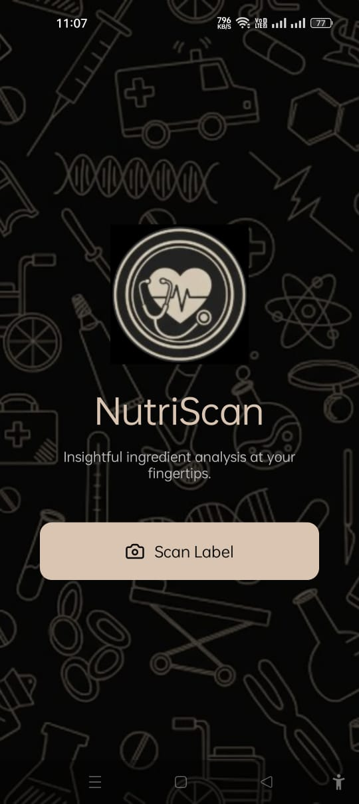
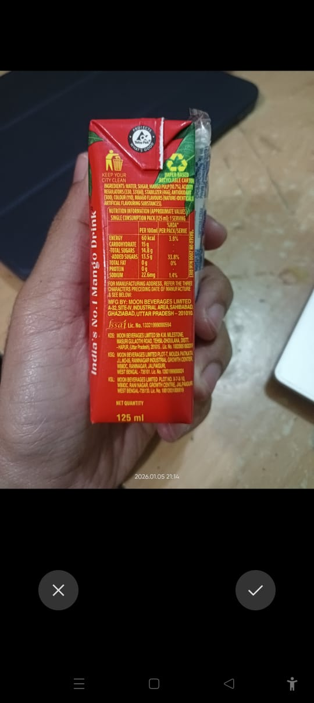
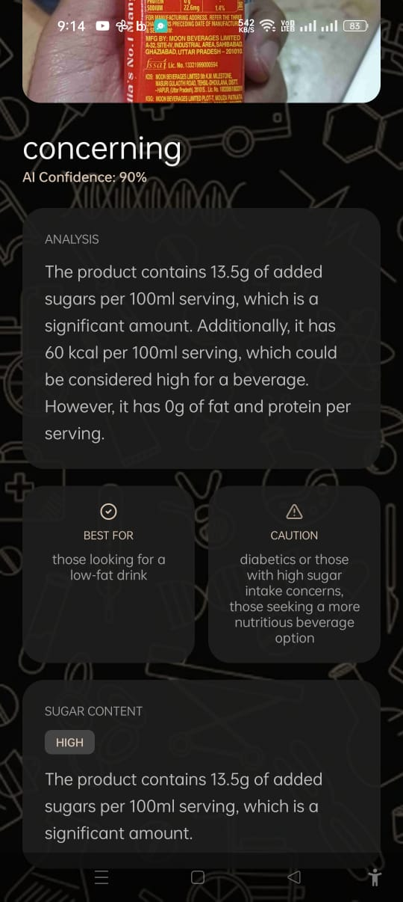

# Ingredient AI Copilot 

Ingredient AI Copilot is a camera-first mobile application that helps users interpret food ingredient lists at the moment of decision. The system uses artificial intelligence as a reasoning co-pilot, transforming complex nutritional information into concise, explainable insights with minimal user interaction.

The project was developed as part of a hackathon focused on AI-native interaction, where AI acts as the primary interface rather than a supporting feature.

---

## Overview

Food packaging already contains ingredient and nutritional information, but interpreting it quickly and meaningfully remains difficult for most users. Ingredient lists are often technical, verbose, and cognitively demanding, especially at purchase or consumption time.

Ingredient AI Copilot addresses this gap by reasoning over ingredient information on the user’s behalf and presenting only what matters, in clear and human-readable form.

---

## Core Idea

The core principle of this project is:

**AI should act as the interface, not just a feature.**

Instead of functioning as a database, lookup tool, or filter-based system, the application interprets ingredient information and delivers a concise verdict along with optional explanations and uncertainty.

The goal is to reduce cognitive load while improving decision quality.

---

## User Experience

The application follows a minimal, camera-first interaction model:

1. The user opens the app and scans the ingredient label of a packaged beverage.
2. The app extracts ingredient text from the image.
3. Key nutritional signals are identified.
4. An AI reasoning core generates a structured verdict.
5. The result is presented with a short explanation and confidence indicator.

No filters, forms, or configuration steps are required.

---

## Screenshots

### Home Screen and Ingredient Capture

<p align="center">
  
  
</p>

<p align="center"><em>Camera-first entry point and ingredient label capture workflow.</em></p>

---

### AI Analysis and Explainability

<p align="center">
  
  
</p>

<p align="center"><em>Structured verdict, suitability guidance, and clear explanation of trade-offs.</em></p>


---

## System Architecture

At a high level, the system follows the pipeline below:

```

Camera Input (Mobile App)
↓
Ingredient Text Extraction
↓
Signal Extraction Layer (Rules + Heuristics)
↓
LLM Reasoning Core
↓
Structured Decision Object
↓
UI + Explainability Layer

```

---

## Signal Extraction Layer

Before invoking the language model, the system extracts meaningful signals from ingredient text to improve reliability and reduce hallucination. These signals include indicators such as:

- High added sugar content
- Artificial sweeteners
- Caffeine presence
- Preservatives or additives

This hybrid approach combines deterministic logic with LLM-based reasoning.

---

## LLM Reasoning Core

The language model is used strictly as a reasoning engine, not as a conversational chatbot. It receives structured signals and produces a deterministic decision object containing:

- A concise verdict
- Key contributing factors
- Human-readable explanations
- An explicit confidence or uncertainty score

This ensures clarity, predictability, and explainability in outputs.

---

## Explainability Approach

Explainability is decision-centric rather than model-centric. Instead of exposing technical model internals, the system explains:

- Why certain ingredients matter
- What trade-offs exist
- Where uncertainty remains

All explanations are short, optional, and written in everyday language.

---

## Scope and Limitations

- The current prototype focuses on packaged beverages to enable domain-aware reasoning and higher explanation quality.
- The design is extensible to other food categories.
- OCR quality and image clarity may affect extraction accuracy, though signal validation mitigates common issues.

---

## Evaluation Alignment

The project aligns with the hackathon evaluation criteria:

- **Experience & Interaction**: Camera-first design with minimal steps
- **Reasoning & Explainability**: Clear verdicts, explanations, and uncertainty disclosure
- **Technical Execution**: Modular hybrid architecture combining rules and LLM reasoning

---

## Repository Structure

```

backend/
├─ index.js
├─ package.json
frontend/
├─ App.js
├─ app.json
├─ package.json
screenshots/
├─ home.jpeg
├─ capture.jpeg
├─ result.jpeg
└─ explainability.jpeg
README.md

```

---

## Running the Project

### Backend
1. Navigate to the `backend/` directory.
2. Install dependencies:
```

npm install

```
3. Configure required environment variables.
4. Start the server:
```

npm start

```

### Frontend
1. Navigate to the `frontend/` directory.
2. Install dependencies:
```

npm install

```
3. Start the Expo development server:
```

npx expo start

```

Ensure the frontend is configured with the correct backend API endpoint.

---

## Demo

A release APK was generated and installed on a physical Android device to demonstrate the full scan-to-verdict workflow using real product labels.

---

## Conclusion

Ingredient AI Copilot demonstrates how AI can function as a true co-pilot—interpreting complex ingredient information, reducing cognitive effort, and enabling better decisions at the moment they matter most.
